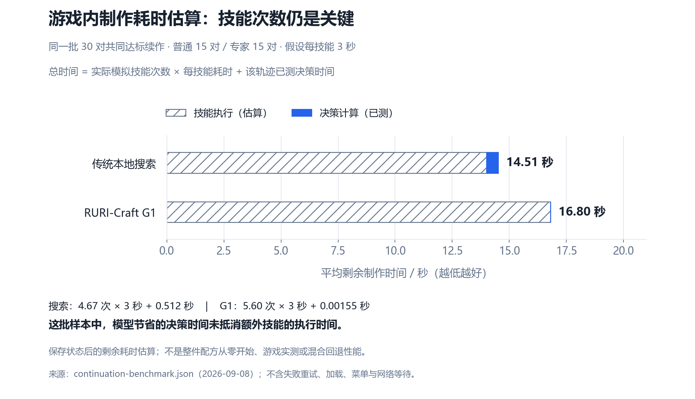

<div align="center">

# RURI-Craft G1

**琉璃 · 第一代生产模型**

面向 FFXIV 八个生产职业的轻量策略模型<br>
根据制作属性、配方、当前状态与合法技能，预测下一技能、目标价值和剩余技能次数。

**[下载模型与权重](https://github.com/KanoNoUta/ruri-crafting-model/releases/tag/v1.0.0-beta.1)** · **[开源训练框架](https://github.com/KanoNoUta/ruri-crafting-framework)** · **[模型说明](MODEL_CARD.md)**

`RURI-Craft-G1` · `v1.0.0-beta.1` · [Apache-2.0](LICENSE)

</div>

<table align="center">
<thead>
<tr>
<th align="center">模型参数</th>
<th align="center">ONNX 体积</th>
<th align="center">输入 / 动作空间</th>
<th align="center">运行方式</th>
</tr>
</thead>
<tbody>
<tr>
<td align="center"><strong>451,404</strong></td>
<td align="center"><strong>1.815 MB</strong></td>
<td align="center"><strong>106 维 / 36 种</strong></td>
<td align="center"><strong>CPU 离线推理</strong></td>
</tr>
</tbody>
</table>

G1 的主要价值是快速提供技能候选，适合作为混合求解的模型分支。本页分别展示与本地传统搜索器的对照，以及与旧神经网络的训练改进。

> [!NOTE]
> 当前为研究测试版，**本地插件已接入模型优先、传统算法回退并通过离线测试，尚未发布插件版本或完成游戏实测**。留存的新教师数据尚未加入这一代模型。

<p align="center">
  <a href="#下载与使用">下载与使用</a> ·
  <a href="#性能表现">性能表现</a> ·
  <a href="#证据与复现">证据与复现</a> ·
  <a href="metadata.json">接口元数据</a> ·
  <a href="modelmaster.json">版本索引</a>
</p>

## 下载与使用

从 **[v1.0.0-beta.1 Release](https://github.com/KanoNoUta/ruri-crafting-model/releases/tag/v1.0.0-beta.1)** 下载所需文件，也可以选择 ZIP 一次下载。ONNX 和 PyTorch 权重都支持 CPU 使用。

<table align="center">
<thead>
<tr>
<th align="center">文件</th>
<th align="center">用途</th>
</tr>
</thead>
<tbody>
<tr>
<td align="center"><code>ruri-craft-g1.onnx</code></td>
<td align="center">离线推理模型</td>
</tr>
<tr>
<td align="center"><code>ruri-craft-g1.weights.pt</code></td>
<td align="center">PyTorch 权重，用于恢复与微调</td>
</tr>
<tr>
<td align="center"><code>metadata.json</code></td>
<td align="center">输入特征、动作空间与接口约定</td>
</tr>
<tr>
<td align="center"><code>SHA256SUMS</code></td>
<td align="center">下载文件完整性校验</td>
</tr>
</tbody>
</table>

将 Release 模型文件放到 `artifacts/` 后，在本仓库根目录运行：

```sh
python -m pip install numpy==1.26.4 onnxruntime==1.20.1 -i https://pypi.tuna.tsinghua.edu.cn/simple
python examples/predict.py --model artifacts/ruri-craft-g1.onnx --metadata metadata.json --input examples/example-input.json
```

> 接入时应配合规则检查、模拟验证和传统算法回退。`value` 尚未完成失败状态概率校准，不能作为安全放行条件。

<details>
<summary><strong>接入约定与微调说明</strong></summary>

示例输入是离线数值状态，自己的调用方需要遵守以下约定：

- 按元数据排列 **106 维 float32 特征**。
- 提供准确的 **36 维布尔合法掩码**；空掩码应停止。
- 标准化已经嵌入模型，**不能重复标准化**。

权重恢复与微调说明见[框架训练文档](https://github.com/KanoNoUta/ruri-crafting-framework/blob/v0.1.0/docs/TRAINING.md)。

</details>

## 性能表现

### 传统本地搜索 vs 模型：时间与计算开销

下图汇总两项实测指标：**相同状态下的单次决策耗时**，以及**各自 48 条续作轨迹的累计决策计算时间**。

<p align="center">
  
</p>

这里的效率体现为决策计算开销；两种方法的续作路径不同，累计耗时不能作为同等工作量吞吐量或完整制作加速倍数。具体测试条件和达标结果见下文。

### 响应速度

在 Ryzen 7 7800X3D 上，对 **24 个相同保存状态**进行对照：

<table align="center">
<thead>
<tr>
<th align="center">指标</th>
<th align="center">本地传统搜索</th>
<th align="center">RURI-Craft G1</th>
</tr>
</thead>
<tbody>
<tr>
<td align="center">单次决策中位耗时</td>
<td align="center">193.009 ms</td>
<td align="center"><strong>0.1701 ms</strong></td>
</tr>
<tr>
<td align="center">工作内容</td>
<td align="center">搜索后返回下一技能，可能无解</td>
<td align="center">编码、合法掩码、ONNX、选技能</td>
</tr>
</tbody>
</table>

此样本集两组中位数之比约为 **1,135 倍**，体现的是候选响应开销的差异。

> [!IMPORTANT]
> 这不是上游 Raphael 对比，不是 128 核教师生成对比，**也不是完整制作快 1,135 倍**。技能动画、执行等待和实际技能次数未包含在响应耗时里；传统搜索还承担了模型预测不具备的搜索工作。

<p align="center">
  
</p>

<details>
<summary><strong>测试环境与计时口径</strong></summary>

<table align="center">
<thead>
<tr>
<th align="center">项目</th>
<th align="center">设置</th>
</tr>
</thead>
<tbody>
<tr>
<td align="center">搜索器</td>
<td align="center">普通：<code>GlobalParetoSearch</code>；专家：<code>DeterministicBeamSearch</code></td>
</tr>
<tr>
<td align="center">搜索预算</td>
<td align="center">每步 1 秒、60,000 节点；关闭宏缓存</td>
</tr>
<tr>
<td align="center">模型运行</td>
<td align="center">CPUExecutionProvider，单线程</td>
</tr>
<tr>
<td align="center">重复测量</td>
<td align="center">模型每起点预热后测 30 次；搜索每起点测 1 次</td>
</tr>
<tr>
<td align="center">统计方式</td>
<td align="center">取每个起点的响应时间，再对 24 个起点取中位数</td>
</tr>
<tr>
<td align="center">排除项</td>
<td align="center">模型加载、进程通信、规则模拟</td>
</tr>
</tbody>
</table>

普通的单步收尾状态中，搜索也可能更快；图中展示了全部起点。

</details>

### 预测精度

在同一份 **44,450 条历史留出状态**中，G1 相比上一版神经网络的表现：

<table align="center">
<thead>
<tr>
<th align="center">指标</th>
<th align="center">旧神经网络基线</th>
<th align="center">G1</th>
<th align="center">变化</th>
</tr>
</thead>
<tbody>
<tr>
<td align="center">整体下一技能一致率</td>
<td align="center">84.36%</td>
<td align="center"><strong>92.01%</strong></td>
<td align="center"><strong>+7.65 个百分点</strong></td>
</tr>
<tr>
<td align="center">整体前三技能覆盖率</td>
<td align="center">97.95%</td>
<td align="center"><strong>98.68%</strong></td>
<td align="center">+0.73 个百分点</td>
</tr>
<tr>
<td align="center">剩余技能次数预测 MAE</td>
<td align="center">0.677 次</td>
<td align="center"><strong>0.573 次</strong></td>
<td align="center"><strong>误差降低 15.39%</strong></td>
</tr>
</tbody>
</table>

“一致率”表示与教师下一技能标签相同，**不等于制作成功率**，也不是比传统算法更准确的证据。历史留出集已重复使用，专家分支方案曾受到其中回退诊断的启发，因此这不是新的独立盲测。

<p align="center">
  
</p>

<details>
<summary><strong>各类配方的详细表现</strong></summary>

<table align="center">
<thead>
<tr>
<th align="center">下一技能一致率</th>
<th align="center">状态数</th>
<th align="center">旧神经网络基线</th>
<th align="center">G1</th>
<th align="center">变化</th>
</tr>
</thead>
<tbody>
<tr>
<td align="center">普通配方</td>
<td align="center">41,720</td>
<td align="center">84.98%</td>
<td align="center">92.79%</td>
<td align="center">+7.81 个百分点</td>
</tr>
<tr>
<td align="center">严格专家标签</td>
<td align="center">2,339</td>
<td align="center">73.02%</td>
<td align="center">78.97%</td>
<td align="center">+5.94 个百分点</td>
</tr>
<tr>
<td align="center">宇宙概率标签</td>
<td align="center">391</td>
<td align="center">85.42%</td>
<td align="center">86.70%</td>
<td align="center">+1.28 个百分点</td>
</tr>
</tbody>
</table>

宇宙概率子集的 Top-3 从 **99.49% 降到 98.72%**，也保留在原始报告中。

</details>

### 模拟达标与实际技能次数

从每类 8 个保存状态继续制作，每状态使用 2 个相同随机种子，每种方法共 **48 条续作轨迹**：

<table align="center">
<thead>
<tr>
<th align="center">分组</th>
<th align="center">本地传统搜索达标</th>
<th align="center">G1 达标</th>
</tr>
</thead>
<tbody>
<tr>
<td align="center">普通状态</td>
<td align="center">16 / 16</td>
<td align="center">15 / 16</td>
</tr>
<tr>
<td align="center">严格专家标签状态</td>
<td align="center">16 / 16</td>
<td align="center">15 / 16</td>
</tr>
<tr>
<td align="center">宇宙概率标签状态</td>
<td align="center">0 / 16</td>
<td align="center">2 / 16</td>
</tr>
<tr>
<td align="center"><strong>合计（分层等权）</strong></td>
<td align="center"><strong>32 / 48</strong></td>
<td align="center"><strong>32 / 48</strong></td>
</tr>
</tbody>
</table>

在两种方法**共同达标的 30 条配对轨迹**中，剩余实际技能次数中位数为搜索 **3 次**、模型 **4 次**。目前不能宣称 G1 已减少实际技能次数或达到最短路径，宇宙高难总体仍有明显短板。

这是少量历史中间状态的模拟续作测试，**不是全游戏配方成功率，也不是游戏客户端实测**。

<p align="center">
  
</p>

<details>
<summary><strong>达标条件与样本边界</strong></summary>

- 两种方法使用同一套规则模拟器，每步都读取实际模拟结果重新决策。
- 达标要求完成进度且满足原品质目标；失败、无建议和耗尽步数都留在分母中。
- 每状态的两个种子共享起点，不能算成两个独立配方。
- 本次对照不启用模型失败后的算法回退，不代表混合系统最终效果。

</details>

### 游戏内制作耗时估算

技能执行也需要时间。按 **每次技能 3 秒**、决策与技能依次执行进行简单估算：

**剩余制作时间 = 实际模拟技能次数 × 3 秒 + 该轨迹累计决策时间。**

取上面两种方法**共同达标的同一批 30 对轨迹**（普通 15 对、专家 15 对），逐条计算后求平均：

<table align="center">
<thead><tr><th align="center">每条续作平均</th><th align="center">传统本地搜索</th><th align="center">RURI-Craft G1</th></tr></thead>
<tbody>
<tr><td align="center">实际模拟技能次数</td><td align="center">4.67 次</td><td align="center">5.60 次</td></tr>
<tr><td align="center">技能执行时间（估算）</td><td align="center">14.00 秒</td><td align="center">16.80 秒</td></tr>
<tr><td align="center">决策时间（已测）</td><td align="center">0.512 秒</td><td align="center">0.00155 秒</td></tr>
<tr><td align="center"><strong>总剩余时间（估算）</strong></td><td align="center"><strong>14.51 秒</strong></td><td align="center"><strong>16.80 秒</strong></td></tr>
</tbody>
</table>

<p align="center">
  
</p>

在这批样本中，G1 平均多用约 **0.93 次技能**，节省的决策时间未抵消技能执行时间，总剩余时间约多 **2.29 秒（15.8%）**。按每技能 2 秒估算，两者为 **9.85 秒 / 11.20 秒**，模型仍约多 1.36 秒。因此，当前证据支持“更快给出候选”，尚不支持“游戏内制作更快”。

这是从保存的初始或中间状态继续制作的**剩余耗时估算**，不是整件配方从零制作，也不是客户端实测。实际插件的技能间隔、等待状态、菜单及网络延迟会改变时间；缓存或宏还可能减少传统算法的决策开销。此处只比较共同成功的轨迹，未计失败重试，也未计混合系统的验证与回退开销。

[查看逐条估算与 2–3 秒敏感性结果](evidence/crafting-duration-estimate.json) · [计算口径](docs/BENCHMARKS.md#游戏内剩余制作时间估算)

### 计算代价

两种方法完成各自 48 条续作轨迹的累计决策计算时间：

<table align="center">
<thead>
<tr>
<th align="center">本地传统搜索</th>
<th align="center">RURI-Craft G1</th>
</tr>
</thead>
<tbody>
<tr>
<td align="center"><strong>28.191 秒</strong></td>
<td align="center"><strong>0.127 秒</strong></td>
</tr>
</tbody>
</table>

两者访问的中间状态、停止位置和动作数不同，这只是本次运行的资源记录，**不能据此推算同等工作量吞吐、能耗或租机费用**。

<p align="center">
  
</p>

<details>
<summary><strong>与旧神经网络的体积及延迟对比</strong></summary>

G1 用双分支换取更好的技能一致率：

<table align="center">
<thead>
<tr>
<th align="center">历史同机指标</th>
<th align="center">旧单网络</th>
<th align="center">G1</th>
</tr>
</thead>
<tbody>
<tr>
<td align="center">ONNX 中位延迟</td>
<td align="center">0.0510 ms</td>
<td align="center">0.0964 ms</td>
</tr>
<tr>
<td align="center">模型文件体积</td>
<td align="center">0.907 MB</td>
<td align="center">1.815 MB</td>
</tr>
</tbody>
</table>

这组历史数据只测预编码后的 ONNX，不能与本次 7800X3D 的完整决策时间混算。

</details>

## 证据与复现

<table align="center">
<thead>
<tr>
<th align="center">内容</th>
<th align="center">文档与原始数据</th>
</tr>
</thead>
<tbody>
<tr>
<td align="center">模型评估</td>
<td align="center"><a href="evidence/baseline-holdout.json">旧模型评估</a> · <a href="evidence/g1-holdout.json">G1 评估</a> · <a href="evidence/paired-comparison.json">历史配对对比</a></td>
</tr>
<tr>
<td align="center">续作与发布</td>
<td align="center"><a href="evidence/continuation-benchmark.json">同机续作原始结果</a> · <a href="evidence/release-validation.json">发布校验</a></td>
</tr>
<tr>
<td align="center">复现基准</td>
<td align="center"><a href="https://github.com/KanoNoUta/ruri-crafting-framework/blob/v0.1.0/benchmarks/g1-cases.jsonl">固定基准输入</a> · <a href="https://github.com/KanoNoUta/ruri-crafting-framework/blob/v0.1.0/scripts/benchmark_model.py">基准脚本</a></td>
</tr>
<tr>
<td align="center">图表与口径</td>
<td align="center"><a href="scripts/render_charts.py">原有图表脚本</a> · <a href="scripts/render_solver_comparison.py">时间与开销对比图脚本</a> · <a href="docs/BENCHMARKS.md">评估口径</a></td>
</tr>
</tbody>
</table>

生成图表：安装 Matplotlib 3.9.4 后运行 `python scripts/render_charts.py`、`python scripts/render_solver_comparison.py` 和 `python scripts/render_crafting_duration.py`。中文字体使用微软雅黑或 Noto Sans CJK SC。

---

<p align="center">
  <a href="https://github.com/KanoNoUta/ruri-crafting-model/releases/tag/v1.0.0-beta.1">下载 RURI-Craft G1</a> ·
  <a href="https://github.com/KanoNoUta/ruri-crafting-framework">训练框架</a> ·
  <a href="LICENSE">Apache-2.0</a>
</p>
