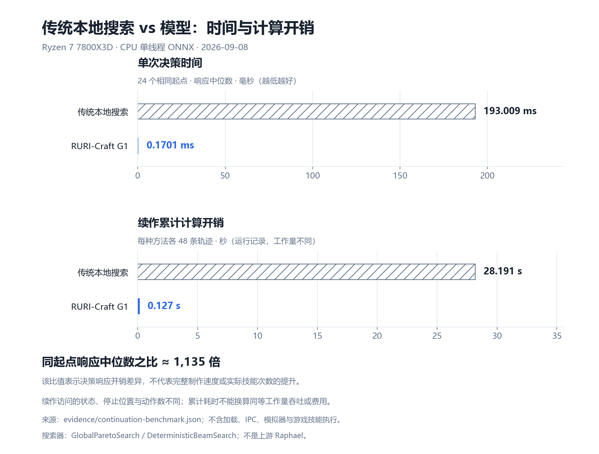
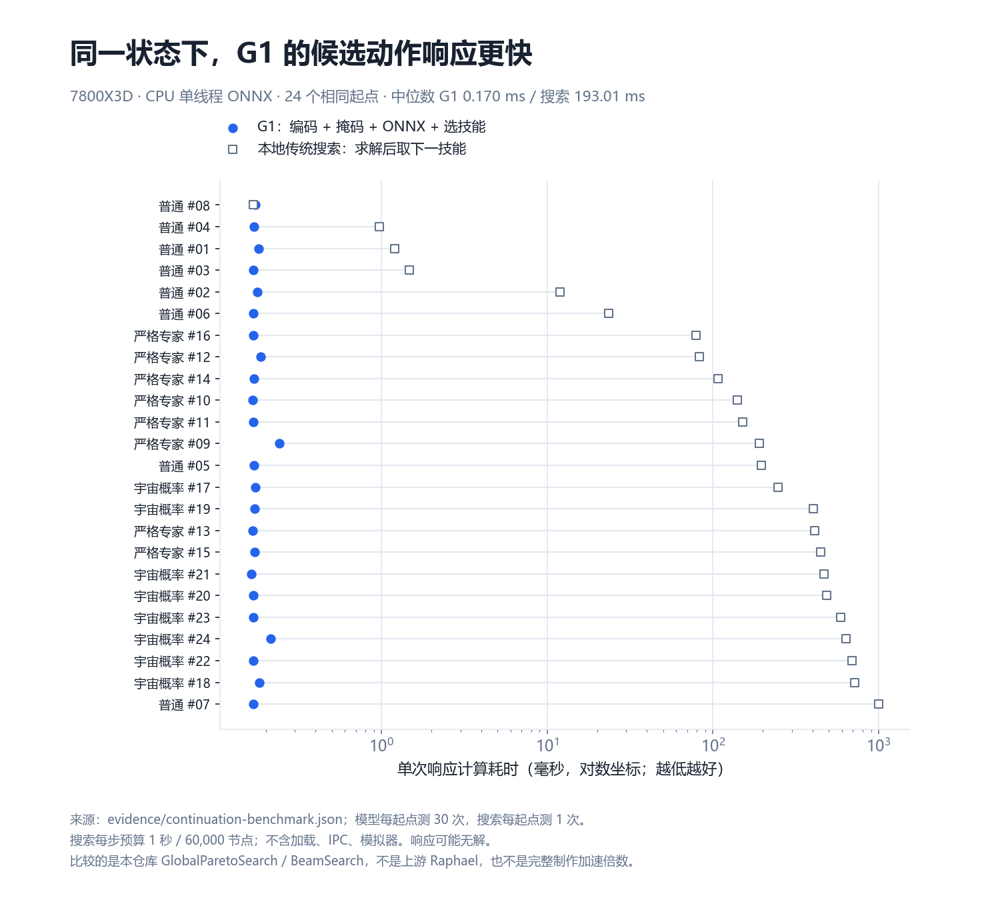
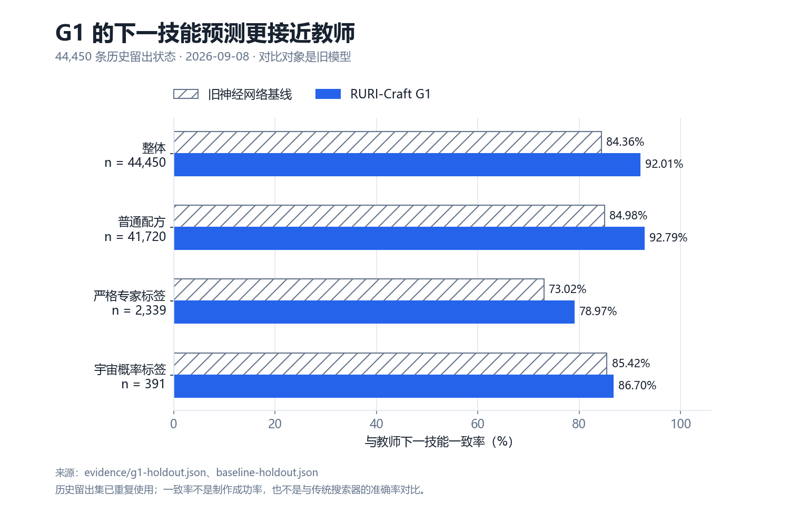
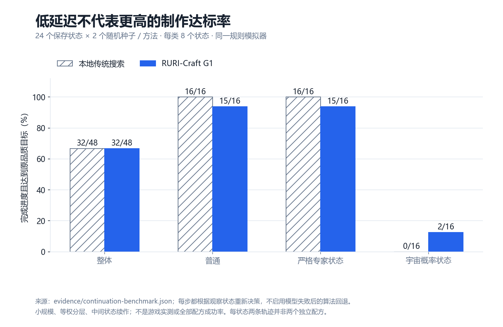
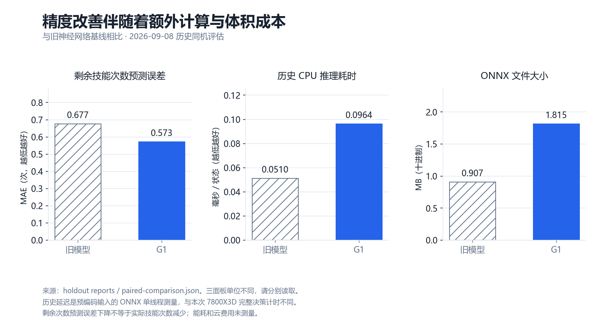

<div align="center">

# RURI-Craft G1

**琉璃 · 第一代生产模型**

面向 FFXIV 八个生产职业的轻量策略模型<br>
根据制作属性、配方、当前状态与合法技能，预测下一技能、目标价值和剩余技能次数。

**[下载模型与权重](https://github.com/KanoNoUta/ruri-crafting-model/releases/tag/v1.0.0-beta.1)** · **[开源训练框架](https://github.com/KanoNoUta/ruri-crafting-framework)** · **[模型说明](MODEL_CARD.md)**

`RURI-Craft-G1` · `v1.0.0-beta.1` · [Apache-2.0](LICENSE)

</div>

| 模型参数 | ONNX 体积 | 输入 / 动作空间 | 运行方式 |
| :---: | :---: | :---: | :---: |
| **451,404** | **1.815 MB** | **106 维 / 36 种** | **CPU 离线推理** |

G1 的主要价值是快速提供技能候选，适合作为混合求解的模型分支。本页分别展示与本地传统搜索器的对照，以及与旧神经网络的训练改进。

> [!NOTE]
> 当前为研究测试版，**尚未集成或发布到插件**。留存的新教师数据尚未加入这一代模型。

<p align="center">
  <a href="#下载与使用">下载与使用</a> ·
  <a href="#性能表现">性能表现</a> ·
  <a href="#证据与复现">证据与复现</a> ·
  <a href="metadata.json">接口元数据</a> ·
  <a href="modelmaster.json">版本索引</a>
</p>

## 下载与使用

从 **[v1.0.0-beta.1 Release](https://github.com/KanoNoUta/ruri-crafting-model/releases/tag/v1.0.0-beta.1)** 下载所需文件，也可以选择 ZIP 一次下载。ONNX 和 PyTorch 权重都支持 CPU 使用。

| 文件 | 用途 |
| --- | --- |
| `ruri-craft-g1.onnx` | 离线推理模型 |
| `ruri-craft-g1.weights.pt` | PyTorch 权重，用于恢复与微调 |
| `metadata.json` | 输入特征、动作空间与接口约定 |
| `SHA256SUMS` | 下载文件完整性校验 |

将 Release 模型文件放到 `artifacts/` 后，在本仓库根目录运行：

```sh
python -m pip install numpy==1.26.4 onnxruntime==1.20.1 -i https://pypi.tuna.tsinghua.edu.cn/simple
python examples/predict.py --model artifacts/ruri-craft-g1.onnx --metadata metadata.json --input examples/example-input.json
```

> 接入时应配合规则检查、模拟验证和传统算法回退。`value` 尚未完成失败状态概率校准，不能作为安全放行条件。

<details>
<summary><strong>接入约定与微调说明</strong></summary>

示例输入是离线数值状态，自己的调用方需要遵守以下约定：

- 按元数据排列 **106 维 float32 特征**。
- 提供准确的 **36 维布尔合法掩码**；空掩码应停止。
- 标准化已经嵌入模型，**不能重复标准化**。

权重恢复与微调说明见[框架训练文档](https://github.com/KanoNoUta/ruri-crafting-framework/blob/v0.1.0/docs/TRAINING.md)。

</details>

## 性能表现

### 传统本地搜索 vs 模型：时间与计算开销

下图汇总两项实测指标：**相同状态下的单次决策耗时**，以及**各自 48 条续作轨迹的累计决策计算时间**。

<p align="center">
  
</p>

这里的效率体现为决策计算开销；两种方法的续作路径不同，累计耗时不能作为同等工作量吞吐量或完整制作加速倍数。具体测试条件和达标结果见下文。

### 响应速度

在 Ryzen 7 7800X3D 上，对 **24 个相同保存状态**进行对照：

| 指标 | 本地传统搜索 | RURI-Craft G1 |
| --- | ---: | ---: |
| 单次决策中位耗时 | 193.009 ms | **0.1701 ms** |
| 工作内容 | 搜索后返回下一技能，可能无解 | 编码、合法掩码、ONNX、选技能 |

此样本集两组中位数之比约为 **1,135 倍**，体现的是候选响应开销的差异。

> [!IMPORTANT]
> 这不是上游 Raphael 对比，不是 128 核教师生成对比，**也不是完整制作快 1,135 倍**。技能动画、执行等待和实际技能次数未包含在响应耗时里；传统搜索还承担了模型预测不具备的搜索工作。

<p align="center">
  
</p>

<details>
<summary><strong>测试环境与计时口径</strong></summary>

| 项目 | 设置 |
| --- | --- |
| 搜索器 | 普通：`GlobalParetoSearch`；专家：`DeterministicBeamSearch` |
| 搜索预算 | 每步 1 秒、60,000 节点；关闭宏缓存 |
| 模型运行 | CPUExecutionProvider，单线程 |
| 重复测量 | 模型每起点预热后测 30 次；搜索每起点测 1 次 |
| 统计方式 | 取每个起点的响应时间，再对 24 个起点取中位数 |
| 排除项 | 模型加载、进程通信、规则模拟 |

普通的单步收尾状态中，搜索也可能更快；图中展示了全部起点。

</details>

### 预测精度

在同一份 **44,450 条历史留出状态**中，G1 相比上一版神经网络的表现：

| 指标 | 旧神经网络基线 | G1 | 变化 |
| --- | ---: | ---: | ---: |
| 整体下一技能一致率 | 84.36% | **92.01%** | **+7.65 个百分点** |
| 整体前三技能覆盖率 | 97.95% | **98.68%** | +0.73 个百分点 |
| 剩余技能次数预测 MAE | 0.677 次 | **0.573 次** | **误差降低 15.39%** |

“一致率”表示与教师下一技能标签相同，**不等于制作成功率**，也不是比传统算法更准确的证据。历史留出集已重复使用，专家分支方案曾受到其中回退诊断的启发，因此这不是新的独立盲测。

<p align="center">
  
</p>

<details>
<summary><strong>各类配方的详细表现</strong></summary>

| 下一技能一致率 | 状态数 | 旧神经网络基线 | G1 | 变化 |
| --- | ---: | ---: | ---: | ---: |
| 普通配方 | 41,720 | 84.98% | 92.79% | +7.81 个百分点 |
| 严格专家标签 | 2,339 | 73.02% | 78.97% | +5.94 个百分点 |
| 宇宙概率标签 | 391 | 85.42% | 86.70% | +1.28 个百分点 |

宇宙概率子集的 Top-3 从 **99.49% 降到 98.72%**，也保留在原始报告中。

</details>

### 模拟达标与实际技能次数

从每类 8 个保存状态继续制作，每状态使用 2 个相同随机种子，每种方法共 **48 条续作轨迹**：

| 分组 | 本地传统搜索达标 | G1 达标 |
| --- | ---: | ---: |
| 普通状态 | 16 / 16 | 15 / 16 |
| 严格专家标签状态 | 16 / 16 | 15 / 16 |
| 宇宙概率标签状态 | 0 / 16 | 2 / 16 |
| **合计（分层等权）** | **32 / 48** | **32 / 48** |

在两种方法**共同达标的 30 条配对轨迹**中，剩余实际技能次数中位数为搜索 **3 次**、模型 **4 次**。目前不能宣称 G1 已减少实际技能次数或达到最短路径，宇宙高难总体仍有明显短板。

这是少量历史中间状态的模拟续作测试，**不是全游戏配方成功率，也不是游戏客户端实测**。

<p align="center">
  
</p>

<details>
<summary><strong>达标条件与样本边界</strong></summary>

- 两种方法使用同一套规则模拟器，每步都读取实际模拟结果重新决策。
- 达标要求完成进度且满足原品质目标；失败、无建议和耗尽步数都留在分母中。
- 每状态的两个种子共享起点，不能算成两个独立配方。
- 本次对照不启用模型失败后的算法回退，不代表尚未完成接入的混合系统最终效果。

</details>

### 计算代价

两种方法完成各自 48 条续作轨迹的累计决策计算时间：

| 本地传统搜索 | RURI-Craft G1 |
| ---: | ---: |
| **28.191 秒** | **0.127 秒** |

两者访问的中间状态、停止位置和动作数不同，这只是本次运行的资源记录，**不能据此推算同等工作量吞吐、能耗或租机费用**。

<p align="center">
  
</p>

<details>
<summary><strong>与旧神经网络的体积及延迟对比</strong></summary>

G1 用双分支换取更好的技能一致率：

| 历史同机指标 | 旧单网络 | G1 |
| --- | ---: | ---: |
| ONNX 中位延迟 | 0.0510 ms | 0.0964 ms |
| 模型文件体积 | 0.907 MB | 1.815 MB |

这组历史数据只测预编码后的 ONNX，不能与本次 7800X3D 的完整决策时间混算。

</details>

## 证据与复现

| 内容 | 文档与原始数据 |
| --- | --- |
| 模型评估 | [旧模型评估](evidence/baseline-holdout.json) · [G1 评估](evidence/g1-holdout.json) · [历史配对对比](evidence/paired-comparison.json) |
| 续作与发布 | [同机续作原始结果](evidence/continuation-benchmark.json) · [发布校验](evidence/release-validation.json) |
| 复现基准 | [固定基准输入](https://github.com/KanoNoUta/ruri-crafting-framework/blob/v0.1.0/benchmarks/g1-cases.jsonl) · [基准脚本](https://github.com/KanoNoUta/ruri-crafting-framework/blob/v0.1.0/scripts/benchmark_model.py) |
| 图表与口径 | [原有图表脚本](scripts/render_charts.py) · [时间与开销对比图脚本](scripts/render_solver_comparison.py) · [评估口径](docs/BENCHMARKS.md) |

生成图表：安装 Matplotlib 3.9.4 后运行 `python scripts/render_charts.py` 和 `python scripts/render_solver_comparison.py`。中文字体使用微软雅黑或 Noto Sans CJK SC。

---

<p align="center">
  <a href="https://github.com/KanoNoUta/ruri-crafting-model/releases/tag/v1.0.0-beta.1">下载 RURI-Craft G1</a> ·
  <a href="https://github.com/KanoNoUta/ruri-crafting-framework">训练框架</a> ·
  <a href="LICENSE">Apache-2.0</a>
</p>
